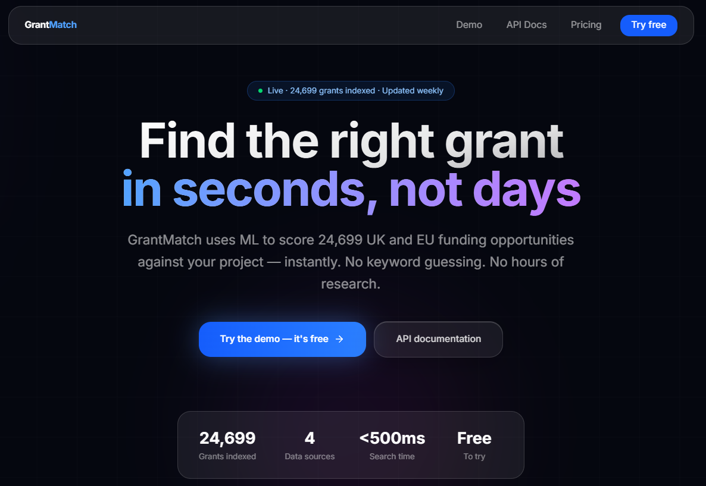
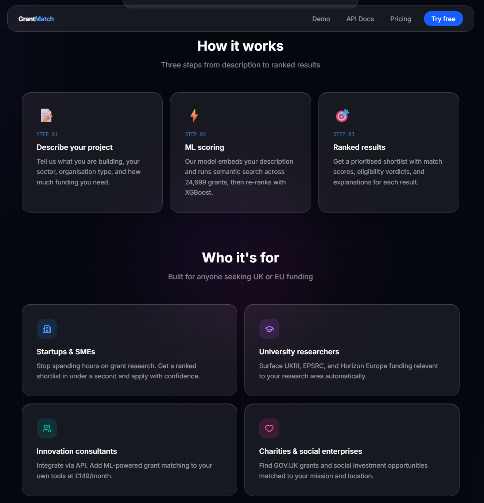
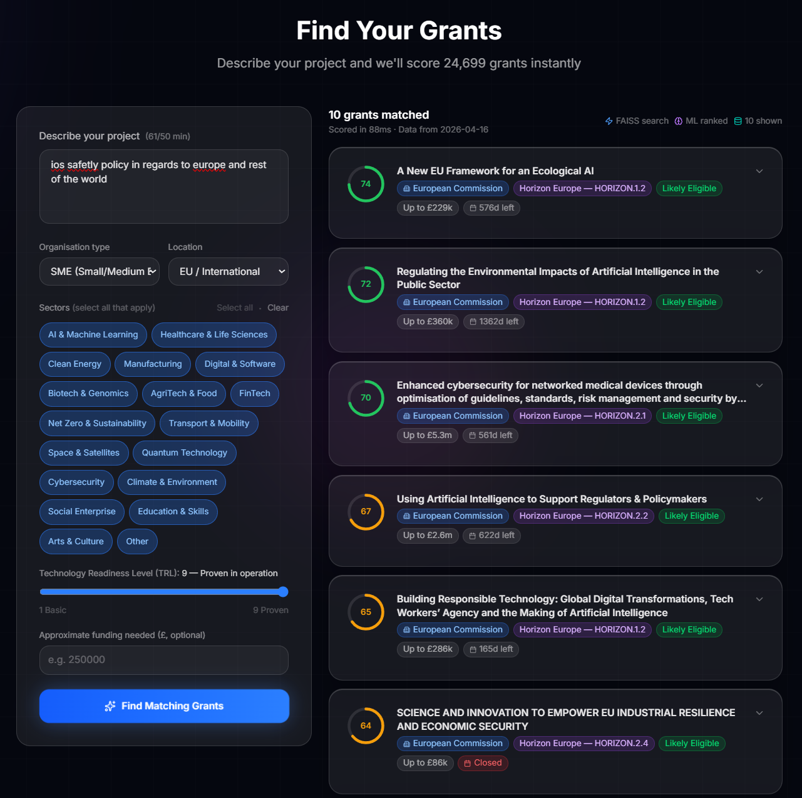

<div align="center">

# GrantMatch

**ML-powered grant matching for UK & EU funding — ranked results in under 500 ms**

[](https://grantmatch-api-production.up.railway.app/health)
[](https://grantmatch-web.vercel.app)
[](https://www.python.org)
[](https://fastapi.tiangolo.com)
[](https://nextjs.org)
[](LICENSE)

[**Live Demo**](https://grantmatch-web.vercel.app/demo) · [**API Docs**](https://grantmatch-api-production.up.railway.app/docs) · [**Web Repo**](https://github.com/samiurk70/grantmatch-web) · [**API Repo**](https://github.com/samiurk70/grantmatch-api)

---

<!-- Replace with your own screenshot: docs/screenshots/hero.png -->


*Drop your project description in, get a ranked shortlist of 24,699 grants in under a second.*

</div>

---

## What is GrantMatch?

GrantMatch is a full-stack ML application that scores every UK and EU grant opportunity against a company or research profile — instantly. Unlike existing grant search tools that rely on keyword matching, GrantMatch embeds both the applicant profile and grant descriptions into a shared semantic space, retrieves the closest candidates with a FAISS vector index, and re-ranks them with a feature-rich scoring pipeline.

**No keyword guessing. No hours of research. A ranked shortlist in < 500 ms.**

---

## Screenshots

<table>
<tr>
<td width="50%">

<!-- Replace with: docs/screenshots/landing.png -->


**Landing page** — hero, stats bar, how it works, who it's for, pricing

</td>
<td width="50%">

<!-- Replace with: docs/screenshots/demo-form.png -->


**Demo search form** — iOS liquid-glass design, sector tags, TRL slider

</td>
</tr>
<tr>
<td width="50%">

<!-- Replace with: docs/screenshots/results.png -->


**Ranked results** — score ring, eligibility verdict, expandable factors

</td>
<td width="50%">

---

## Architecture

```
┌─────────────────────────────────────────────────────────────┐
│  Next.js 16 · Vercel                                        │
│  grantmatch-web.vercel.app                                  │
│                                                             │
│  Landing · Demo · Docs · Pricing                            │
│  Liquid-glass UI · Framer Motion · shadcn/ui                │
│         │  POST /api/match (secure proxy, rate-limited)     │
└─────────────────────────────────────────────────────────────┘
                           │
                           ▼
┌─────────────────────────────────────────────────────────────┐
│  FastAPI · Python 3.11 · Docker · Railway                   │
│  grantmatch-api-production.up.railway.app                   │
│                                                             │
│  1. Embed query  →  sentence-transformers (all-MiniLM-L6)  │
│  2. Retrieve     →  FAISS IndexFlatIP (24,699 vectors)      │
│  3. Filter       →  rule-based eligibility (org/TRL/region) │
│  4. Score        →  weighted heuristic (semantic + sector   │
│                      + org type + TRL + region + deadline)  │
│  5. Explain      →  top-3 SHAP/heuristic factors            │
│         │                                                   │
│  PostgreSQL (Railway)  ←  grant data + embeddings           │
└─────────────────────────────────────────────────────────────┘
```

---

## Data Sources

| Source | Records | What it contains |
|--------|--------:|-----------------|
| [UKRI Gateway to Research](https://gtr.ukri.org) | ~5,000 | Historical funded projects — strong signal for what gets funded |
| [Horizon Europe CORDIS](https://cordis.europa.eu) | ~19,478 | EU collaborative R&I grants and project data |
| [GOV.UK Find a Grant](https://www.find-government-grants.service.gov.uk) | ~107 | UK government grants across all sectors |
| [Innovate UK Opportunities](https://www.ukri.org/opportunity/) | ~114 | Live Innovate UK competitions |
| **Total** | **24,699** | |

All data is sourced from free public APIs and scrapes — no paid subscriptions required.

---

## ML Pipeline

```
Profile text
    │
    ▼
sentence-transformers (all-MiniLM-L6-v2)   — 384-dim embedding, L2-normalised
    │
    ▼
FAISS IndexFlatIP search (top-150 candidates)
    │
    ├── min-max normalise inner-product scores → [0.05, 1.0]
    │
    ▼
Eligibility filter (rule-based)
    │
    ├── Region check     (hard drop if location incompatible)
    ├── TRL range check  (hard drop if TRL out of range)
    └── Org type check   (soft: → check_required if mismatch)
    │
    ▼
Feature extraction (9 features per grant)
    │
    ├── semantic_similarity  (40 pts)   — normalised FAISS score
    ├── sector_overlap       (25 pts)   — Jaccard index; 0.5 neutral if unknown
    ├── org_type_match       (15 pts)   — 0 / 0.5 / 1.0
    ├── trl_match            (10 pts)   — 0 / 0.5 / 1.0
    ├── is_open               (5 pts)   — open / upcoming vs closed
    ├── region_match          (5 pts)   — location compatibility
    ├── days_to_deadline      (0 pts)   — in factors / explanations
    ├── funding_fit           (0 pts)   — in factors / explanations
    └── description_length    (0 pts)   — in factors / explanations
    │
    ▼
Weighted heuristic scorer → score ∈ [0, 100]
    │
    └── Top-3 factor explanations (SHAP-style)
```

**XGBoost reranker** (`ml/model.pkl`) is trained and bundled but currently gated behind `_MODEL_ENABLED = False` in `reranker.py` — it was trained on synthetic data and requires retraining on real production grant data before activation. The heuristic produces well-calibrated scores in the meantime.

---

## Live Services

| Service | URL | Platform |
|---------|-----|----------|
| Web app | https://grantmatch-web.vercel.app | Vercel |
| API | https://grantmatch-api-production.up.railway.app | Railway |
| Swagger UI | https://grantmatch-api-production.up.railway.app/docs | Railway |
| Health check | https://grantmatch-api-production.up.railway.app/health | Railway |

---

## API Reference

### Authentication

All protected endpoints require an API key in the request header:

```
X-API-Key: <your-api-key>
```

### Endpoints

| Method | Path | Auth | Description |
|--------|------|:----:|-------------|
| `GET` | `/` | — | Redirects to `/api/v1/` |
| `GET` | `/health` | — | Lightweight liveness probe |
| `GET` | `/api/v1/` | — | API metadata and links |
| `GET` | `/api/v1/health` | — | Full health: model, index, DB, grant count |
| `POST` | `/api/v1/match` | ✓ | **Core endpoint** — match a profile against grants |
| `GET` | `/api/v1/grants` | ✓ | Browse grants (filter by status, sector, limit, offset) |
| `GET` | `/api/v1/grants/{id}` | ✓ | Retrieve a single grant by database ID |
| `GET` | `/docs` | — | Interactive Swagger UI |

---

### `POST /api/v1/match`

Match a company or research profile against 24,699 grants and receive a ranked shortlist with scores and explanations.

**Request body**

```json
{
  "organisation_name": "CropVision Ltd",
  "organisation_type": "sme",
  "description": "We develop drone-based multispectral imaging and AI analytics to help UK farmers monitor crop health, optimise irrigation, and reduce pesticide use. Field trials have demonstrated a 20% yield improvement.",
  "sectors": ["agritech", "ai"],
  "location": "england",
  "trl": 4,
  "funding_needed": 150000,
  "top_n": 5
}
```

| Field | Type | Required | Description |
|-------|------|:--------:|-------------|
| `organisation_name` | string | No | Name of the applicant organisation |
| `organisation_type` | enum | **Yes** | `sme` `startup` `university` `charity` `large_company` `individual` |
| `description` | string ≥50 chars | **Yes** | Project or research description — used for semantic matching |
| `sectors` | string[] | **Yes** | One or more from the [allowed list](#allowed-sectors) |
| `location` | enum | **Yes** | `england` `scotland` `wales` `northern_ireland` `uk` `eu` |
| `trl` | int 1–9 | No | Current Technology Readiness Level |
| `funding_needed` | float | No | Approximate funding needed in GBP |
| `top_n` | int 1–20 | No | Results to return (default: 10) |

**Allowed sectors**

`ai` · `healthcare` · `clean_energy` · `manufacturing` · `net_zero` · `digital` · `biotech` · `agritech` · `fintech` · `transport` · `space` · `quantum` · `cybersecurity` · `climate` · `social` · `arts` · `education` · `other`

**Response**

```json
{
  "profile_summary": "We develop drone-based multispectral imaging...",
  "total_matched": 5,
  "processing_time_ms": 143.2,
  "data_freshness": "2026-04-16",
  "grants": [
    {
      "grant_id": 14821,
      "title": "Innovate UK AI Innovation Fund — Round 1",
      "funder": "Innovate UK",
      "programme": "Innovate UK",
      "summary": "Funding for SMEs developing AI-based solutions...",
      "score": 84.7,
      "confidence": 0.847,
      "status": "open",
      "deadline": "2026-06-30T00:00:00",
      "funding_range": "£50k – £300k",
      "eligibility_verdict": "likely_eligible",
      "top_factors": [
        { "factor_name": "semantic_similarity", "direction": "positive", "impact": 0.91 },
        { "factor_name": "sector_overlap",      "direction": "positive", "impact": 0.80 },
        { "factor_name": "org_type_match",      "direction": "positive", "impact": 1.0  }
      ],
      "url": "https://www.ukri.org/opportunity/..."
    }
  ]
}
```

**Eligibility verdicts**

| Verdict | Meaning |
|---------|---------|
| `likely_eligible` | Passes all hard checks — org type, region, TRL |
| `check_required` | Soft mismatch (sector gap or org type uncertain) — worth reviewing |
| `likely_ineligible` | Hard rule violated — region or TRL out of range |

**PowerShell example (Windows)**

```powershell
$body = @{
    organisation_type = "sme"
    description       = "We develop drone-based multispectral imaging and AI analytics to help UK farmers monitor crop health, optimise irrigation, and reduce pesticide use. Field trials have demonstrated a 20% yield improvement."
    sectors           = @("agritech", "ai")
    location          = "england"
    trl               = 4
    funding_needed    = 150000
    top_n             = 5
} | ConvertTo-Json

Invoke-RestMethod `
  -Uri "https://grantmatch-api-production.up.railway.app/api/v1/match" `
  -Method POST `
  -Headers @{ "X-API-Key" = "YOUR_API_KEY"; "Content-Type" = "application/json" } `
  -Body $body
```

**curl example (macOS / Linux)**

```bash
curl -s -X POST https://grantmatch-api-production.up.railway.app/api/v1/match \
  -H "Content-Type: application/json" \
  -H "X-API-Key: YOUR_API_KEY" \
  -d '{
    "organisation_type": "sme",
    "description": "We develop drone-based multispectral imaging and AI analytics to help UK farmers monitor crop health, optimise irrigation, and reduce pesticide use. Field trials have demonstrated a 20% yield improvement.",
    "sectors": ["agritech", "ai"],
    "location": "england",
    "trl": 4,
    "funding_needed": 150000,
    "top_n": 5
  }' | python -m json.tool
```

---

## Local Development

### Prerequisites

- Python 3.11+
- Node.js 20+ (for the web app)
- PostgreSQL (or use SQLite for dev)

### API setup

```bash
git clone https://github.com/samiurk70/grantmatch-api.git
cd grantmatch-api

# Install Python dependencies
pip install -r requirements.txt

# Copy and edit environment variables
cp .env.example .env
# → set DATABASE_URL, API_KEY, etc.

# Ingest all grant data (takes ~20 min first time)
python -m scripts.ingest_all

# Build FAISS vector index (requires embedder + populated DB)
python -m scripts.build_index

# Train the reranker (optional — heuristic is used if model absent)
python ml/train.py

# Start the API server
uvicorn app.main:app --reload
# → http://localhost:8000
# → http://localhost:8000/docs  (Swagger UI)
```

### Docker (API only)

```bash
docker-compose up --build
# API at http://localhost:8000
```

The Dockerfile pre-downloads `all-MiniLM-L6-v2` at build time so the container starts in ~1 second and never risks Railway's 5-minute healthcheck window.

---

## Environment Variables

### API (`.env`)

| Variable | Default | Description |
|----------|---------|-------------|
| `DATABASE_URL` | `sqlite+aiosqlite:///data/grants.db` | SQLAlchemy async URL. Postgres: `postgresql+asyncpg://...` |
| `EMBEDDING_MODEL` | `all-MiniLM-L6-v2` | HuggingFace sentence-transformer model name |
| `MODEL_PATH` | `ml/model.pkl` | Path to trained XGBoost reranker |
| `FAISS_INDEX_PATH` | `data/grants.faiss` | Path to FAISS index file |
| `API_KEY` | `changeme` | Bearer key for protected endpoints (`X-API-Key` header) |
| `MAX_RESULTS` | `20` | Hard cap on results returned per request |
| `GtR_API_BASE` | `https://gtr.ukri.org/gtr/api` | UKRI Gateway to Research base URL |
| `UKRI_OPPORTUNITIES_URL` | `https://www.ukri.org/opportunity/` | Innovate UK scrape URL |

### Web app (`.env.local`)

| Variable | Description |
|----------|-------------|
| `GRANTMATCH_API_URL` | Base URL of the Railway API (no trailing slash) |
| `GRANTMATCH_API_KEY` | API key forwarded server-side — never exposed to the browser |

---

## Repository Structure

```
grantmatch-api/
├── app/
│   ├── api/
│   │   └── routes.py          # All FastAPI endpoints
│   ├── models/
│   │   ├── db_models.py       # SQLAlchemy Grant model
│   │   └── schemas.py         # Pydantic request / response schemas
│   ├── services/
│   │   ├── embedder.py        # sentence-transformer singleton
│   │   ├── matcher.py         # FAISS search → eligibility → score pipeline
│   │   └── reranker.py        # Heuristic scorer + XGBoost wrapper
│   ├── utils/
│   │   ├── eligibility.py     # Rule-based eligibility filter
│   │   └── feature_extractor.py  # 9-feature vector builder
│   ├── config.py              # Pydantic Settings (reads .env)
│   ├── database.py            # Async SQLAlchemy engine + session factory
│   └── main.py                # FastAPI app, lifespan startup
├── data/
│   ├── ingest/
│   │   ├── ingest_govuk_grants.py
│   │   ├── ingest_ukri_opportunities.py
│   │   ├── ingest_ukri_gtr.py
│   │   └── ingest_cordis.py
│   └── grants.faiss           # Pre-built FAISS index (baked into Docker image)
├── ml/
│   ├── train.py               # XGBoost training script
│   └── model.pkl              # Trained model (baked into Docker image)
├── scripts/
│   ├── build_index.py         # Embed all grants → build FAISS index
│   └── ingest_all.py          # One-shot: ingest + build index + train
├── tests/                     # pytest test suite
├── Dockerfile
├── docker-compose.yml
├── requirements.txt
├── .env.example
└── vercel.json                # Vercel build config (rootDirectory: web/)
```

---

## Deployment

### Railway (API)

Railway builds directly from the `Dockerfile`. The FAISS index (`data/grants.faiss`) and trained model (`ml/model.pkl`) are committed to git and baked into the Docker image so they persist across every redeploy at zero RAM cost.

**After a major grant data refresh:**

```bash
# 1. Point local .env at Railway's public PostgreSQL URL
# 2. Re-run ingestion (from Railway Shell tab)
python -m scripts.ingest_all

# 3. Rebuild FAISS index locally (uses your GPU if available)
python -m scripts.build_index

# 4. Commit and push — Railway rebuilds Docker image with updated artifacts
git add data/grants.faiss ml/model.pkl
git commit -m "chore: refresh grant index and model"
git push
```

### Vercel (Web app)

The web app auto-deploys from the `grantmatch-web` repo on every push to `main`. Set two environment variables in the Vercel dashboard:

| Variable | Value |
|----------|-------|
| `GRANTMATCH_API_URL` | `https://grantmatch-api-production.up.railway.app` |
| `GRANTMATCH_API_KEY` | Your Railway API key |

---

## Tech Stack

| Layer | Technology |
|-------|-----------|
| **API framework** | FastAPI 0.115, Pydantic v2, Python 3.11 |
| **Database** | PostgreSQL (Railway prod) / SQLite (local dev) via SQLAlchemy async |
| **Embeddings** | `sentence-transformers` — `all-MiniLM-L6-v2` (384 dim, ~90 MB) |
| **Vector search** | FAISS `IndexIDMap(IndexFlatIP)` — 24,699 vectors, <10 ms search |
| **Reranker** | Weighted heuristic (9 features); XGBoost classifier (gated) |
| **Explanations** | SHAP `TreeExplainer` / heuristic top-3 factor derivation |
| **Container** | Docker on Railway — CPU-only PyTorch, HF model pre-baked |
| **Web framework** | Next.js 16, React 19, TypeScript |
| **Styling** | Tailwind CSS v4, custom liquid-glass design system |
| **Animation** | Framer Motion 12 |
| **UI components** | shadcn/ui, Radix UI, Lucide icons |
| **Web deploy** | Vercel (Edge Network, Washington D.C. iad1) |

---

## Pricing

| Tier | Price | Includes |
|------|-------|---------|
| **Free** | £0 / month | 50 searches/month · Web app · All 4 grant sources |
| **Pro** | £49 / month | Unlimited searches · API access · Weekly email alerts · Priority support |
| **Teams** | £149 / month | Everything in Pro · 5 API keys · Usage analytics · Custom integrations |

---

## Roadmap

- [ ] Retrain XGBoost on real production grant data → activate `_MODEL_ENABLED = True`
- [ ] Weekly automated grant refresh via Railway cron
- [ ] Email digest: notify users of new grants matching saved profiles
- [ ] Saved searches and user accounts
- [ ] Deadline alerts (7-day and 24-hour push notifications)
- [ ] Grant writing assistant (Claude API integration)

---

## Contributing

1. Fork the repo and create a feature branch
2. Run `pip install -r requirements-dev.txt` for dev tooling (pytest, ruff, mypy)
3. Run tests: `pytest tests/`
4. Open a pull request against `master`

---

<div align="center">

Built with public data from **UKRI** · **Innovate UK** · **GOV.UK** · **European Commission CORDIS**

[grantmatch-web.vercel.app](https://grantmatch-web.vercel.app) · [API on Railway](https://grantmatch-api-production.up.railway.app/docs)

</div>
